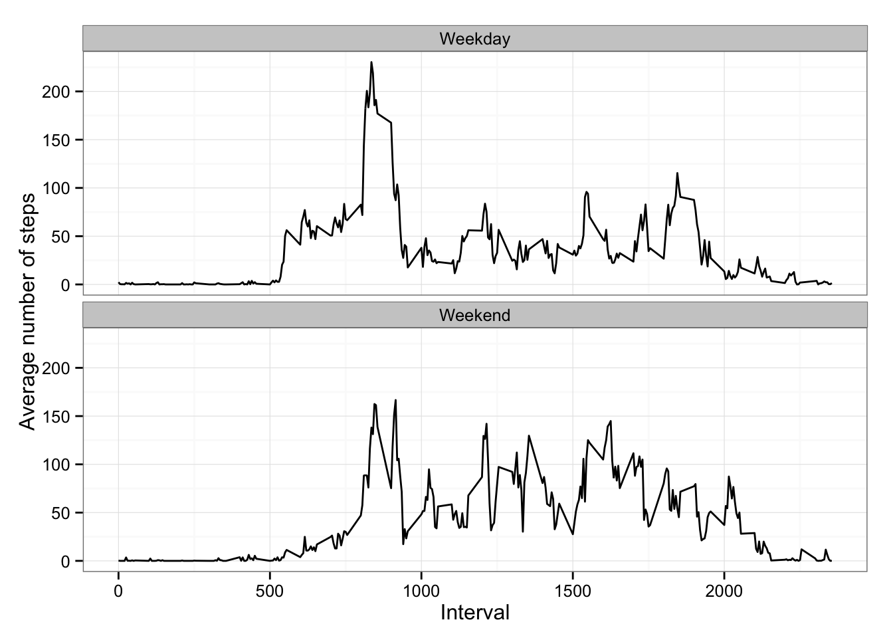

# Reproducible Research: Peer Assessment 1
Dmitry Ermakov  
January 11, 2015  
### Introduction ###
    This assignment makes use of data from a personal activity monitoring device. This device collects data at 5 minute intervals through out the day. The data consists of two months of data from an anonymous individual collected during the months of October and November, 2012 and include the number of steps taken in 5 minute intervals each day.

### Preparing ###
In this section we load nessery libraris and set global options.

#####Load Libraries#####

```r
library(knitr) # For Knitr
library(ggplot2) #For ploting
```

#####Global setings#####

```r
opts_chunk$set(echo = TRUE, cache = TRUE)
setwd("~/Documents/Study/Data Sience/GitHub/Reproducible Research/PA1")
```

### Loading and preprocessing data ###

The data for this assignment can be downloaded from the course web site [Activity monitoring data](https://d396qusza40orc.cloudfront.net/repdata%2Fdata%2Factivity.zip).

The variables included in this dataset are:

- __steps:__ Number of steps taking in a 5-minute interval (missing values are coded as NA)
- __date:__ The date on which the measurement was taken in YYYY-MM-DD format
- __interval:__ Identifier for the 5-minute interval in which measurement was taken
    
The dataset is stored in a comma-separated-value (CSV) file and there are a total of 17,568 observations in this dataset.


```r
dataset <- read.csv("activity.csv",header=TRUE,  na.strings="NA", colClasses=c("numeric", "character", "numeric"))
dataset$date <- as.Date(dataset$date, format="%Y-%m-%d")
```

### What is mean total number of steps taken per day? ###

- Summaraize the total steps per day. Ignore the missing values
- Plot histogram of the total number steps per day
- Calculate and report the **mean** and **median** total number of steps taken per day


```r
stepsPerDay <- aggregate(steps ~ date, data = dataset, FUN = sum, na.rm = TRUE)
```

##### Plot histogram of the total number steps per day #####

```r
hist(stepsPerDay$steps, breaks=30, main="", xlab="Steps per day")
```

 

##### Calculate the mean and median steps per day #####

```r
mSteps <- mean(stepsPerDay$steps)
medSteps <- median(stepsPerDay$steps)
```

The mean is **1.0766 &times; 10<sup>4</sup>** and the median is **1.0765 &times; 10<sup>4</sup>**

```r
summary(stepsPerDay$steps)
```

```
##    Min. 1st Qu.  Median    Mean 3rd Qu.    Max. 
##      41    8840   10800   10800   13300   21200
```

### What is the average daily activity pattern? ###

We make a time series plot of the 5-minute interval (x-axis) and the average number of steps taken, averaged across all days (y-axis)

```r
meanStepsPerInterval <- aggregate(steps ~ interval, data = dataset, FUN = mean, na.rm = TRUE)
plot(meanStepsPerInterval,type="l")
```

 


The interval __#835__ has maximum number of steps = **206**.


####Imputing missing values####

1. We calculate the total number of missing values in the dataset (i.e. the total number of rows with NAs)


```r
misVal <- sum(is.na(dataset$steps))
```
The total number missing values is **2304**

2. Devise a strategy for filling in all of the missing values in the dataset.

We use the mean for that 5-minute interval to fill empty variable of steps .


```r
datasetNA<-dataset[is.na(dataset$steps),]
datasetNA[,1] <- sapply(datasetNA[,3],function(x) round(meanStepsPerInterval[meanStepsPerInterval$interval==x,2]))
```


3. Create a new dataset that is equal to the original dataset but with the missing data filled in.


```r
datasetFilled<-dataset
datasetFilled[is.na(dataset$steps),1] <- sapply(dataset[is.na(datasetFilled$steps),3],function(x) round(meanStepsPerInterval[meanStepsPerInterval$interval==x,2]))
```


4. Make a histogram of the total number of steps taken each day and Calculate the mean and median total number of steps taken per day.


```r
stepsPerDayF <- aggregate(steps ~ date, data = datasetFilled, FUN = sum, na.rm = TRUE)
hist(stepsPerDay$steps, breaks=30, main="Total number of steps after filling NA", xlab="Steps per day")
```

 


The mean before filling is **1.0766 &times; 10<sup>4</sup>** and the median is **1.0765 &times; 10<sup>4</sup>**

The mean after filling is **1.0766 &times; 10<sup>4</sup>** and the median is **1.0762 &times; 10<sup>4</sup>**

 
 There isn't signicant difference.


####Are there differences in activity patterns between weekdays and weekends?####

1. Create a new factor variable in the dataset with two levels – “weekday” and “weekend” indicating whether a given date is a weekday or weekend day.


```r
datasetFilled$weekday <- as.factor(ifelse(weekdays(datasetFilled$date) %in% c("Saturday","Sunday"), "Weekend", "Weekday"))
```


2. Make a panel plot containing a time series plot (i.e. type = "l") of the 5-minute interval (x-axis) and the average number of steps taken, averaged across all weekday days or weekend days (y-axis). 


```r
meanStepsWeekDay<-aggregate(datasetFilled$steps,by=list(interval=datasetFilled$interval,weekday=datasetFilled$weekday),FUN=mean)
names(meanStepsWeekDay)[3] <- "steps"

ggplot(meanStepsWeekDay, aes(x=interval, y=steps)) + 
    geom_line() + 
    facet_wrap(~ weekday, nrow=2, ncol=1) +
    theme_bw()+
    labs(x="Interval", y="Average number of steps")
```

 

